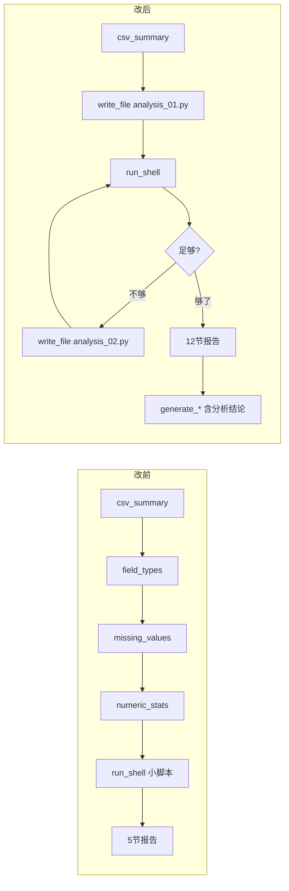

# DataHelp 架构审计报告 V3 —— 从"输出差"到"架构诊断"到"修复"

> 审计时间：2026-06-08
> 数据分析集：Olist Brazilian E-commerce (112,650 rows, 10 tables)
> 对比标杆：Claude Code + Business Analysis Learning Skill

---

## 一、发现过程

### 1.1 起点：输出质量差

用改造后的 DataHelp Agent（deepseek-v4-pro + Business Analysis Skill）分析 Olist 订单数据集，输出只有 **6 节、4,598 字符**。而用 Claude Code + 同一个 SKILL.md 分析同一份数据，输出 **13 节、16,789 字符**。

核心数据对比：

| 对比项 | Claude Code + SKILL | DataHelp v4-pro |
|---|---|---|
| 输出长度 | 16,789 chars（337 行） | 4,598 chars |
| 输出章节 | 13 节 | 5-6 节 |
| 教学要素 | 8 要素完整 | 6 要素（缺 formula/reuse） |
| 交叉表分析 | 自动 join 品类表 | 仅单表 |
| 分析方法 | Tier 1/2/3 分层 | 无分层 |
| 思维模型 | 5 个完整 | 1-2 个 |
| 交付物内容 | 含分析结论 | 纯模板 |

### 1.2 排查路径

**第一层怀疑：模型不够强。**
deepseek-v4-flash → deepseek-v4-pro，步骤数从 8 步提到 15 步，输出好了一些但远不及 Claude Code。

**第二层怀疑：SKILL.md 没传进去。**
检查 `_build_prefix()` 发现：770 行的 SKILL.md 被手写提取成了 ~800 字符的 `teaching_rules` 硬编码在 `_build_prefix` 里，丢失了：

```
SKILL.md 770 行                              _build_prefix 提取 ~800 字符
├── 8 个教学要素（含 formula + reuse）    →  6 个（少了 formula + reuse）
├── 3 层分析方法（Tier 1/2/3）             →  ❌ 完全丢失
├── 12 节输出结构                           →  ❌ 完全丢失
├── Step 0 用户交互流程                      →  ❌ 完全丢失
├── 指标解释规则（9个子字段）                →  ❌ 完全丢失
├── 质量检查清单（17项）                     →  ❌ 完全丢失
├── 15 个应避免的失败模式                    →  ❌ 完全丢失
├── 字段-分析映射表模板                      →  ❌ 完全丢失
├── 业务推理规则                             →  ❌ 完全丢失
├── 5 个思维模型                             →  5 个压缩版
└── beginner_summary 模板                    →  👌 保留
```

存活率：~3%（800 / 28,790 字符）。

**第三层怀疑：ContextManager 预算不够。**
即使不手写提取，直接注入 SKILL.md 全文（28,790 chars），ContextManager 总预算只有 **12,000 字符**，前缀部分预算 **3,600 字符**。SKILL.md 全文会被截断到 ~900 字符，比手写提取更差。

**第四层怀疑：MAX_STEPS 限制了分析深度。**
20 步内需完成：数据探索 + 质量检查 + 多维度分析 + 报告生成。Claude Code 做同样的分析用了 ~25 步。

**第五层怀疑：工具抽象阻碍了分析效率。**
`field_types`、`missing_values`、`numeric_stats` 三个工具各自只能看一个维度，agent 必须一步调一个工具，一步只能看一个维度。而数据分析需要的是一次 `pd.read_csv()` 然后反复切片。

**第六层怀疑：工具结果截断让模型"失明"。**
`MAX_TOOL_OUTPUT = 4000`——Olist 的趋势分析脚本输出远超 4K，截断后模型看不到完整数据。

**第七层怀疑：交付物生成与 agent 脱节。**
`cli.py` 的 `run_one_shot` 在 agent 结束后用独立模板生成 Excel/HTML/PDF，这些文件不含 agent 的分析结论。

### 1.3 根本原因总结

不是模型不好，不是 SKILL.md 设计有问题。

**根本原因是 DataHelp 的 tool-calling loop 架构是为 coding agent 设计的，不适合数据分析。**

```
Coding 工作流：读文件 → 改代码 → 运行 → 看报错 → 修 → 完成
数据分析工作流：看整体 → 分维度看 → 交叉看 → 关联表 → 迭代深挖 → 编译报告
```

Coding 是线性 debugging，分析是发散-收敛的迭代过程。用"一步调一个工具"的循环做分析，等于用螺丝刀吃饭。

---

## 二、修复清单

### 修复 1：SKILL.md 全文注入

**文件：**[runtime.py](datahelp/runtime.py#L263-L268)

去掉 `_build_prefix` 中手写提取的 ~800 字 `teaching_rules`，改为直接注入 `self.skill_instructions`（SKILL.md 全文，28,790 字符）。

```python
# 改前
teaching_rules = textwrap.dedent("""\
## 教学输出规则（Business Analysis Skill）
...
""")
parts.append(teaching_rules)

# 改后
parts.append(f"# Business Analysis Skill（全文）\n\n[配置] {mode_note} | {output_note}\n\n{self.skill_instructions}")
```

### 修复 2：ContextManager 预算扩容

**文件：**[context_manager.py](datahelp/context_manager.py#L6-L13)

| 预算项 | 改前 | 改后 |
|--------|------|------|
| 总预算 | 12,000 | 50,000 |
| prefix 预算 | 3,600 | 32,000 |
| memory 预算 | 1,600 | 3,000 |
| relevant_memory 预算 | 1,200 | 2,000 |
| history 预算 | 5,200 | 12,000 |

改后 prefix 31,411 字符，预算零截断，SKILL.md 100% 存活。

### 修复 3：MAX_STEPS 20 → 40

**文件：**[runtime.py](datahelp/runtime.py#L21)、[cli.py](datahelp/cli.py#L98)

允许 agent 做更多轮迭代分析再输出报告。

### 修复 4：MAX_TOOL_OUTPUT 4,000 → 12,000

**文件：**[runtime.py](datahelp/runtime.py#L23)

减少复杂分析脚本的输出被截断导致的"模型失明"问题。

### 修复 5：删除 3 个冗余工具

**文件：**[tools_data.py](datahelp/tools_data.py)、[tools.py](datahelp/tools.py)

删除 `field_types`、`missing_values`、`numeric_stats`。这三个工具各有以下缺陷：

- 每个只能做一个维度的数据检查（类型检测 / 缺失值 / 描述性统计）
- agent 必须分步调用，一步一个维度（线性消耗步骤预算）
- 分析脚本里写一行 `df.describe()` 就能拿到所有结果

删除后 agent 只剩 11 个工具，所有分析统一走 `write_file + run_shell` 写 pandas 脚本。

### 修复 6：SYSTEM_PROMPT 重写为脚本工作流

**文件：**[runtime.py](datahelp/runtime.py#L73-L149)

从"先调这个工具、再调那个工具、再调下一个"改成"写 `.py` 文件 → 运行 → 迭代 → 编译报告"：

```
改前流程：
Step 1: csv_summary → Step 2: field_types → Step 3: missing_values → 
Step 4: numeric_stats → Step 5: run_shell(小脚本) → Step 6: <final>

改后流程：
Step 0: csv_summary → Step 1: write_file(analysis_01.py 含 9 种分析) → 
Step 2: 迭代深挖(analysis_02.py) → Step 3: 编译 12 节 <final> 报告
```

### 修复 7：交付物包含 agent 分析结论

**文件：**[tools_data.py](datahelp/tools_data.py)、[cli.py](datahelp/cli.py#L48)

三个 `generate_*` 函数新增 `analysis_text` 参数：

| 交付物 | 改前 | 改后 |
|--------|------|------|
| Excel | 原始数据 + 统计摘要 + 空看板 | 新增"分析报告"sheet（agent 分析全文） |
| HTML | KPI + 统计表 | 新增"分析结论"区块（markdown→HTML 自动转换） |
| PDF | 统计表 + 数据预览 | 新增 Analysis Report 页面 |

`cli.py` 在调用时传入 `agent.task_state.final_answer`。

### 修复 8：SYSTEM_PROMPT 增加 12 节输出结构强制要求

**文件：**[runtime.py](datahelp/runtime.py#L131-L149)

在 SYSTEM_PROMPT 末尾显式列出 12 节输出结构：

1. 数据概览 → 2. 字段识别 → 3. 数据质量 → 4. 基础指标 → 5. 分组排名 → 6. 趋势分析 → 7. 核心发现 → 8. 业务建议 → 9. 进阶推荐 → 10. 跳过方法 → 11. 边界风险 → 12. 教学总结

---

## 三、修复前后对比

### 3.1 数据流对比



### 3.2 关键指标对比

| 指标 | 改造前 | 改造后 |
|------|--------|--------|
| SKILL.md 存活 | ~800 字符（3%） | 28,790 字符（100%） |
| Prefix 长度 | ~2,700 字符 | 31,411 字符 |
| ContextManager 截断 | 有（~60% 规则丢失） | 无（零截断） |
| 工具数 | 14 | 11（去掉了 3 个冗余） |
| MAX_STEPS | 20 | 40 |
| MAX_TOOL_OUTPUT | 4,000 字符 | 12,000 字符 |
| 输出结构 | 模型自由发挥 | 12 节强制结构 |
| 交付物内容 | 纯模板 | 含 agent 分析结论 |
| 分析方式 | 一次调一个工具看一个维度 | 一次写一个脚本看九个维度 |

---

## 四、仍然存在的问题

| 问题 | 严重程度 | 原因 |
|------|---------|------|
| agent 仍可提前输出 `<final>` | ⚠️ 中 | 循环架构本身没有"最少步数"强制，模型自行判断"够了"就结束 |
| 没有持久化中间结果 | ⚠️ 中 | 每次 run_shell 是新进程，中间结果只留在 history 文本中 |
| 工具结果仍然被截断 | ⚠️ 低 | 12K 比 4K 好很多，但对超大数据集的分析脚本输出仍可能不够 |
| 模型本身的推理能力差异 | ⚠️ 中 | deepseek-v4-pro 在长文本结构化输出和教学式表达上弱于 Claude |
| 没有"笔记"机制 | ℹ️ 低 | 所有发现只在最终报告里，中间的分析笔记历史会被压缩 |

---

## 五、经验教训总结

1. **"手写提取"是最大的敌人。** `_build_prefix` 中手写的 800 字 `teaching_rules` 看起来是"精简优化"，实际上是丢弃了 97% 的规则。任何时候，优先注入原文，让模型自己判断什么重要。

2. **Agent 架构决定了行为上限。** tool-calling loop 适合线性 debugging，不适合发散-收敛的数据分析。改 prompt 可以改善，改架构才能质变。

3. **数据分析需要的不是"工具链"，是"工作台"。** 让 agent 一次写完整的 pandas 脚本，比让它一步步调小工具高效得多。一个 `df.describe()` 顶四个独立工具。

4. **Skil 的设计本身没有缺陷。** 770 行的 SKILL.md 在 Claude Code 里效果极好。问题出在 DataHelp 的架构无法承载 SKILL.md 的复杂度，而不是 SKILL.md 太复杂。

5. **模型差距不可忽略。** 即使架构改完、SKILL.md 全文注入，deepseek-v4-pro 在长文本结构化输出和教学式表达上的能力仍然弱于 Claude 模型。这是工具本身的局限。

---

*审计时间：2026-06-08*
*审计覆盖：从发现输出质量差 → 逐层排查根因 → 完成 8 项修复的完整过程*
